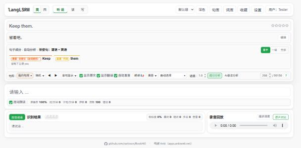

# langLSRW

**Listen · Speak · Read · Write**: a browser-based app for practising English and Spanish through dictation, shadowing, vocabulary review and your own sentence libraries.

**Live:** [lang.mltz.tech](https://lang.mltz.tech)



langLSRW is a static web app with no backend for learning data. Sign in through the MLTZ account centre using Google or your username/Passkey. The account centre issues a BookHill OIDC code after login and any required TOTP, keeping the stable Kanidm user ID. Learning data stays in the browser; users who bind Google and grant BookHill Drive access can also sync it to their own Google Drive. The BookHill server hosts code and a stateless sentence parser.

The user interface is in Simplified Chinese. Button names below are translated.

## Features

**Learning languages.** English and Spanish, switched with 英 / 西. Libraries, word lists, favourites and review progress are kept separately per language.

**Listening and dictation**
- Sentence-by-sentence dictation with live word-level feedback, plus accuracy, speed, fluency and error statistics.
- Read-aloud at adjustable speed, single-word replay, auto-read, and audio + LRC materials that play the original recording for each sentence.
- Ordered, random and mistakes-only modes, with configurable keyboard shortcuts.

**Speaking.** Hold-to-speak speech recognition with recording playback, scored against the model sentence: similarity, missing, wrong and extra words.

**Sentence libraries**
- Import your own material: text, TSV, LRC, Anki / Tatoeba exports, pasted text, or a **Google Sheet**.
- Every import opens a preview. You can create a new library or append to an existing one. Duplicates are detected regardless of case and spacing, and their translations can be merged, kept or replaced.
- The app remembers your position in every library, and any library can be exported back to text.

**Reading (读)**
- A passage library (课文库) next to the sentence library and the vocabulary: each passage is a title plus a body, filed under English or Spanish.
- The reading page loads one passage, shows it in large type split into sentences, and gives each sentence its own highlight colour. Click a sentence to hear it. Right-click a word to look it up.
- A whiteboard beside the passage keeps free notes with that passage. Passages and notes are personal data, so a Google account syncs them to that user's Drive.

**Vocabulary (词库)**
- Offline dictionaries installed into the browser: ECDICT (English–Chinese, 770k entries) and Spanish Wiktionary with frequency ranks.
- Built-in word lists include Oxford 3000, CET4/6, IELTS, TOEFL and GRE for English, and frequency tiers for Spanish.
- **My word lists (我的词表):** import your own from text/TSV or a Google Sheet, with append, de-duplication and import-order sorting.
- Preview, review and test sessions with spaced repetition, plus favourites with ratings.

**Sentence components** (English, Spanish). One click marks subject, predicate (with tense and voice), object, predicative, complement, attributive and adverbial, down to clauses and phrases. It is free and instant: a [spaCy](https://spacy.io) dependency parser on the server, mapped to traditional teaching grammar in the browser. Being automatic, it can be wrong on hard sentences.

**AI grammar analysis** (English). An on-demand, hierarchical breakdown of the current sentence, cached per sentence. It uses your own OpenAI-compatible endpoint and API key (Settings → AI).

**Interface.** Light and dark modes that follow the system, five colour palettes (default, GitHub, Reddit, Twitter, Anki), configurable fonts and grammar colours, and a layout that works down to phone width.

## Getting started

1. Open [lang.mltz.tech](https://lang.mltz.tech) and sign in with your MLTZ account, or continue as a local user. To sync, bind Google in the account centre, then choose **Check binding and connect Drive** in BookHill. Account login and Drive authorization are separate.
2. Download what you need from the [data release](https://github.com/carloscn/BookHill/releases/tag/dictionaries-2026.10):
   - **Dictionaries:** install with Settings → 本地词典 → 从文件安装.
   - **Sentence libraries:** import with 句库 → 导入.
     - `common-english-30150.tsv`: 30,150 English sentences with Chinese translations.
     - `common-spanish-134910.tsv`: 134,910 Spanish sentences with English translations, from [Tatoeba](https://tatoeba.org).

## Importing sentences and words

The recommended format is UTF-8 text with one entry per line and `|` between the entry and its translation:

```text
# Lines starting with # are comments
Hello | 你好
¿Qué es eso? | 那是什么？
```

The same formats work for word lists, for example `apple | 苹果`, or one word per line.

| Source | Shape |
|---|---|
| Text (`.txt`) | `entry \| translation`, or one entry per line with an optional translation on the next line |
| TSV (`.tsv`) | `entry⇥translation` or `id⇥entry⇥translation` (Anki / Tatoeba / manythings.org exports work as-is) |
| Lyrics (`.lrc`) | timestamps are stripped (sentence libraries only) |
| Google Sheets | pick the spreadsheet in Google's file picker, then choose the columns and whether the first row is a header |

A library or word list imported from a Google Sheet remembers its source. Choose **Update from sheet** after editing the spreadsheet, and new rows are merged in using the same de-duplication rules.

## Your data

| What | Where |
|---|---|
| Libraries, word lists, favourites, review progress, settings | the browser (IndexedDB), under the stable IDM subject. After verified Google binding and Drive authorization, also in `langLSRW/langlsrw-userdata.json` and `langLSRW/libraries/*.tsv` in the user's own Drive |
| Dictionaries | the browser's private file system (OPFS), installed from a downloaded file |
| AI API key | the browser only, encrypted (see below). It is never exported or synced |

Google access uses the least-privileged `drive.file` scope: the app only sees files it created, or spreadsheets you pick. Unbound users cannot sync or read Google Sheets. The original BookHill Google client and file paths remain in use; verified legacy Google data is copied without deleting the old browser copy. AI keys must be entered again for the new identity. See [account integration and rollout](docs/ACCOUNT_INTEGRATION.md).

## Security of your API key

- **Encrypted at rest:** AES-GCM (WebCrypto) under a non-extractable key generated in the browser, or with an unlock password (PBKDF2-SHA256, 600,000 iterations), or kept in memory only for the current page.
- **Bound to its endpoint and identity:** each ciphertext is tied to the user and the API origin. Only `https://` endpoints are accepted (plain `http` only for `localhost`).
- **Never displayed, exported or synced:** only a hint such as `sk-…a1b2` is shown.
- **Content-Security-Policy:** only this site's and Google's scripts may run. There are no inline scripts except one hashed bootstrap, and no `eval`. This is the main defence against injected script.

For the best protection, create a dedicated key with a spending limit at your AI provider.

## Browser support

Read-aloud and speech recognition use the browser's Web Speech API. Chrome or Edge on a desktop is recommended. Firefox and Brave can dictate but lack speech recognition, and offer fewer voices.

## Running locally

The app is plain static files:

```bash
python3 -m http.server 8849
```

Open <http://localhost:8849/>. Local users work immediately. Production account/Drive integration is restricted to the registered site; see [`deploy/README.md`](deploy/README.md) and [`docs/ACCOUNT_INTEGRATION.md`](docs/ACCOUNT_INTEGRATION.md). On localhost, sentence components use the production parser, which allows localhost through CORS.

## Project structure

```text
index.html                  App shell, CSP and public configuration (Google client ID, Picker key)
src/
  app.js                    UI and practice flows
  user-data.js              Personal data store (IndexedDB), export/import documents
  library-import.js         Import parsing and de-duplication (pure, tested)
  passage.js                Passage splitting for the reading page (pure, tested)
  library-store.js          Sentence libraries in IndexedDB
  idm-auth.js               Public Kanidm OIDC code/PKCE login and Google binding lookup
  idm-policy.js             Identity boundaries for Drive data and migration
  google-drive.js           Verified Google Drive authorization, files, Picker, Sheets API
  cloud-sync.js             Drive sync rules (pure, tested)
  secret-store.js           API-key encryption (pure, tested)
  syntax-tree.js            Dependency parse -> sentence components (pure, tested)
  dictionary/               Dictionary service + sqlite-wasm Worker (OPFS)
  languages/                English / Spanish rules
  styles.css                Design tokens (nav.mltz.tech), light/dark × palettes
services/parser/            Sentence parser service (spaCy + FastAPI, Docker)
tools/                      Dictionary build tools
data/                       Licences and source data (not deployed)
deploy/                     Deploy scripts, nginx config, setup guide
docs/                       Design and mechanism notes (Chinese)
tests/                      Node unit tests
```

## Development

```bash
node --test tests/*.test.js .agents/skills/*/scripts/*.test.js
```

Dictionary packages are built with `npm run build:dictionary` (English) and `npm run build:dictionary:es` (Spanish) from sources kept outside the repository. See [`data/dictionaries/README.md`](data/dictionaries/README.md).

## Deployment

Every push and pull request is tested by [GitHub Actions](.github/workflows/deploy.yml). **Publishing a GitHub Release whose tag starts with `v`** deploys it to lang.mltz.tech once its tests pass. Data releases (e.g. `dictionaries-*`) never deploy. [`deploy/deploy.sh`](deploy/deploy.sh) syncs only `index.html` and `src/` through an allowlist and content-hashes every asset URL. The parser service is deployed separately with [`deploy/deploy-parser.sh`](deploy/deploy-parser.sh). Setup details are in [`deploy/README.md`](deploy/README.md).

## Acknowledgements

- [BookHill](https://github.com/Aviator-shuke/BookHill), the project this app is developed from.
- [Anki](https://apps.ankiweb.net/) inspired the Anki palette and much of the thinking behind sentence-based practice.
- [ECDICT](https://github.com/skywind3000/ECDICT) (MIT) and [Wiktionary](https://www.wiktionary.org/) via [Kaikki](https://kaikki.org) (CC BY-SA 4.0) provide the dictionaries.
- [Tatoeba](https://tatoeba.org) provides sentence pairs (CC BY 2.0 FR).
- [spaCy](https://spacy.io) provides the dependency parses behind sentence components.
- [SQLite](https://sqlite.org) (WebAssembly build) runs the dictionaries in the browser.
